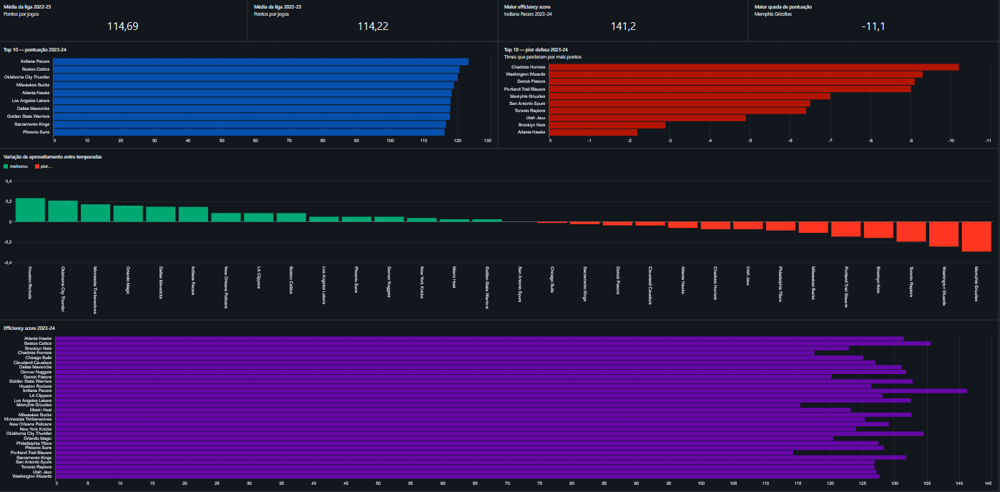

# 🏀 NBA Team Stats Analysis — 2022-23 & 2023-24


Comparative analysis of NBA team performance across two consecutive seasons using SQL on Databricks. The project covers the full data pipeline — from raw ingestion and cleaning to unified silver layer — and answers 15 business questions on win rate, scoring, efficiency, assists, and turnovers.

---

## 📁 Project Structure

```
nba-team-stats-analysis/
├── README.md
├── data/
│   └── raw/
│       ├── nba_2022_23.csv               # Raw data — 2022-23 season
│       └── nba_2023_24.csv               # Raw data — 2023-24 season
├── notebooks/
│   ├── 01_cleaning_unification.sql       # Ingestion, cleaning and UNION ALL → silver
│   └── 02_analysis.ipynb                 # 15 business questions
└── assets/
    └── dashboard_overview.png
```

---

## 🔄 Pipeline

```
data/raw/*.csv  →  bronze (tables)  →  silver.team_stats  →  analysis (15 queries)
```

**Notebook 01** reads both CSVs from the `raw/` volume, creates bronze tables, renames all columns to `snake_case`, casts types, and unifies both seasons into `nba.silver.team_stats` via `UNION ALL`.

**Notebook 02** runs 15 business questions directly on `nba.silver.team_stats`.

---

## 🗄️ Data Source

- **Origin:** Public NBA team statistics (NBA.com)
- **Seasons:** 2022-23 and 2023-24
- **Catalog:** `nba.silver.team_stats` — Databricks Unity Catalog
- **Key columns:** `team_name`, `season`, `ranking`, `wins`, `win_pct`, `avg_pts`, `avg_ast`, `avg_tov`, `plus_minus`

---

## ❓ Business Questions

| # | Question |
|---|----------|
| 1 | Which teams had the highest average points per game in 2023-24? |
| 2 | Which teams finished 2022-23 with more than 50 wins? |
| 3 | Which teams had a win rate above 60% in any season? |
| 4 | Which 5 teams had the worst defense (most points allowed) in 2022-23? |
| 5 | Which teams averaged more than 27 assists per game in any season? |
| 6 | What was the league-wide average scoring per season? |
| 7 | How many teams finished with a positive plus/minus in each season? |
| 8 | Which team accumulated the most total wins across both seasons? |
| 9 | Which teams had turnovers above the league average in 2023-24? |
| 10 | What was the scoring gap between the best and worst offense each season? |
| 11 | Which teams improved their win rate from 2022-23 to 2023-24? |
| 12 | Which teams were in the top 10 scoring in both seasons? |
| 13 | Which team had the biggest scoring drop between seasons? |
| 14 | What is the efficiency ranking using a composite score (pts + ast − tov)? |
| 15 | Which teams had 50%+ win rate in both seasons but never cracked the top 5 in scoring? |

---

## ⚙️ SQL Techniques Used

- **Aggregations:** `AVG`, `SUM`, `MAX`, `MIN`, `COUNT`, `ROUND`
- **Joins:** self-joins to cross-reference seasons
- **Subqueries:** nested `SELECT` inside `WHERE IN`
- **Filtering:** `WHERE`, `AND`, `IN` with nested subqueries
- **Custom metric:** composite `efficiency_score` column

---

## 📊 Efficiency Score Metric

Custom ranking formula applied to the 2023-24 season:

```sql
ROUND(avg_pts + avg_ast - avg_tov, 1) AS efficiency_score
```

Combines offensive output (points + assists) penalized by ball losses (turnovers), giving a single number to compare team efficiency across the league.

---

## 📈 Dashboard



---

## 🛠️ Stack

| Tool | Usage |
|------|-------|
| Databricks | Notebook environment and query execution |
| SQL | Full pipeline — ingestion, cleaning, analysis |
| Unity Catalog | Data storage (`nba.bronze` and `nba.silver`) |
| Databricks Dashboard | KPI visualization |

---

## 👤 Author

**Luiz Gustavo Ferreira Silva**
[LinkedIn](https://linkedin.com/in/luiz-gustavo00) · [GitHub](https://github.com/LuizGFS001)
